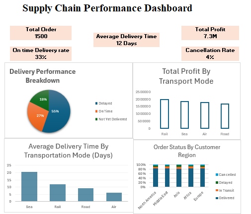

# Supply Chain Analysis Dashboard (2024–2026)

## Overview
A complete Excel-based Supply- Chain analysis project, covering data cleaning, transformation,
and dashboard design using Power Query, PivotTables, and PivotCharts.

## Business Problem

## Tools Used
- Microsoft Excel (Tables, PivotTables, PivotCharts)
- Power Query (data cleaning, filtering, merging)
- GitHub (version control, documentation)

## Data Preparation
The original raw file was kept untouched in `data/raw/`, with all cleaning done on a separate working copy. Full details: [power-query/documentation.md](power-query/documentation.md)

## Power Query Transformations
Data was loaded into Power Query, verified for quality (no missing values, no duplicate order IDs) Full details: [power-query/documentation.md](power-query/documentation.md)

## Analysis

- Full details: [power-query/documentation.md](power-query/documentation.md)

## Dashboard
- A single-page dashboard combining 5 KPI cards (Total Orders, Total Profit, Average Delivery Time, On-Time Delivery Rate, Cancellation rate) with  charts covering Delivery Performance, Average Delivery Time by transport mode, Profit by Transport Mode, and order Status by customer region

## Key Insights
- Delivery Performance: The analysis shows that 55% of orders were delayed, while 27% were delivered on time and 18% had not yet been delivered.

- Most and Least Profitable Transport Modes: Railway is the most profitable transport mode, whereas Road is the least profitable.

- Average Delivery Time by Transport Mode: Sea transport has the fastest average delivery time, while Air transport has the slowest average delivery time.

- Region with the Highest Number of Delays and Cancellations: North America recorded the highest number of delays and cancellations, with 22 delays and 12 cancellations.

- Chart Recommendation: The Order Status by Customer Region chart should be presented as a 100% Stacked Column Chart. This format provides a clearer comparison of the proportional distribution of order statuses across the five regions, whereas a standard stacked column chart makes proportional differences more difficult to assess.

Full details: [documentation/business-insights.md](documentation/business-insights.md)

## Dataset
- Source: Kaggle.com
-1500 orders originally
- 24 columns including 

## Project Structure

supplychain-analysis-dashboard/

├── data/raw/ → original untouched dataset

├── excel/ → working Excel file with Tables, Power Query, Pivots, Dashboard

├── power-query/ → Power Query transformation documentation

├── screenshots/ → dashboard screenshot

└── documentation/ → data dictionary, analysis notes, business insights

## Skills Demonstrated

